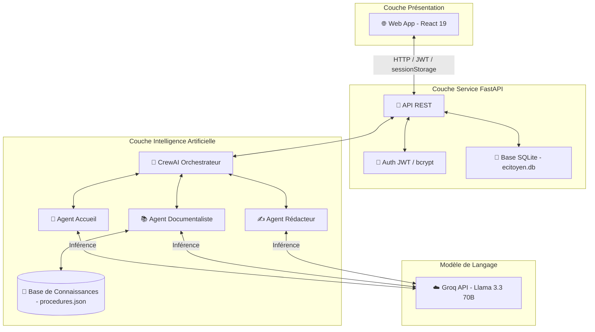
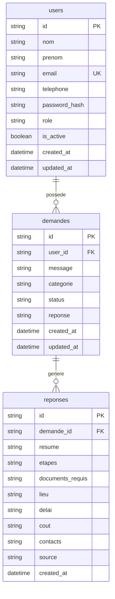

# Documentation du projet

## 1. Présentation
**e-Citoyen CI** est un assistant administratif intelligent pour les citoyens ivoiriens, développé par l'équipe **IA Force CI (Team 17)** pour le **Challenge IA 2026** (Leading Change Africa & Intro Group). Le projet repose sur un écosystème multi-agents intelligent capable de comprendre la situation d'un citoyen en langage naturel, d'identifier les démarches à suivre, et de générer un plan d'action personnalisé ainsi que des lettres administratives adaptées à la situation.

---

## 2. Objectifs
- **Simplifier les démarches** : Aider les citoyens à identifier les justificatifs, les coûts, les lieux et les délais d'obtention de leurs documents officiels (CNI, acte de naissance, CMU, etc.).
- **Accessibilité universelle** : Intégrer des technologies de commande et de synthèse vocales pour inclure les populations peu à l'aise avec la lecture et l'écriture.
- **Accompagnement de bout en bout** : Fournir des plans d'action clairs pour des événements de vie complexes (ex: la naissance d'un enfant impliquant plusieurs administrations comme la mairie, la CNPS et la CMU).

---

## 3. Fonctionnalités disponibles
- **Interaction en langage naturel** : Analyse textuelle ou vocale des requêtes citoyennes complexes.
- **Traitement multi-agents** : Orchestration via CrewAI de 3 agents spécialisés (Accueil, Documentaliste, Rédacteur) connectés à un LLM (llama-3.3-70b-versatile via Groq).
- **Assistance vocale intégrée** :
  - 🎤 *Reconnaissance vocale* (Speech-to-Text) en français via la Web Speech API du navigateur.
  - 🔊 *Synthèse vocale* (Text-to-Speech) pour lire à haute voix le plan d'action généré.
- **Gestion des lettres** : Copie dans le presse-papiers ou envoi par email du courrier administratif généré par l'IA.
- **Tableau de bord citoyen** : Visualisation de l'historique des demandes, de leur statut d'avancement et statistiques d'activité.

---

## 4. Architecture globale
Le système e-Citoyen CI repose sur une architecture découplée orientée services.



### Frontend
- Application SPA codée à la main en **React 19** et **Vite 8**.
- Intégration de la Web Speech API native pour le traitement STT et TTS.
- Gestion d'état locale avec React Contexts pour l'authentification et la persistance de session via `sessionStorage`.

### Backend
- API REST faite en **FastAPI** sous **Python 3.12**.
- Tâches asynchrones (`BackgroundTasks`) pour l'exécution d'inférence sans bloquer les requêtes clients.
- Rate limiting avec **SlowAPI** pour la protection des quotas d'inférence.

### Base de données
- Base relationnelle locale **SQLite** (`ecitoyen.db`).
- Interfacée avec le backend via l'ORM **SQLAlchemy**.

---

## 5. Structure du projet
```txt
e-citoyen/E-citoyenCI/
├── backend/                  # Partie serveur
│   ├── app/
│   │   ├── agents/          # Définition des agents CrewAI et outils
│   │   ├── api/             # Routers et points d'entrée API
│   │   ├── auth/            # Dépendances de sécurité et validation JWT
│   │   ├── database/        # Modèles, connexions et sessions SQLAlchemy
│   │   ├── schemas/         # Schémas de validation Pydantic (User, Demandes)
│   │   └── services/        # Logique métier (AuthService, DemandeService)
│   ├── main.py              # Point d'entrée FastAPI
│   └── pyproject.toml       # Manifeste des dépendances (UV)
│
├── web/                      # Interface utilisateur Web
│   ├── src/
│   │   ├── app/             # Écrans (pages/) et éléments graphiques (components/)
│   │   ├── contexts/        # États partagés globaux (AuthContext)
│   │   ├── hooks/           # Hooks personnalisés (useAuth)
│   │   └── services/        # Client HTTP d'API (api.ts, authService.ts)
│   ├── index.html
│   └── package.json         # Dépendances Node.js
│
├── audit.txt                 # Rapport d'audit de sécurité
└── documentation.md          # Documentation unifiée (ce fichier)
```

---

## 6. Installation

### Prérequis
- **Python 3.12**
- **Node.js** (v18 ou supérieur) + **npm**
- **UV** (gestionnaire de paquets Python rapide)

### Installation du Backend
1. Naviguer dans le dossier backend :
   ```bash
   cd backend
   ```
2. Installer les dépendances avec UV :
   ```bash
   uv sync
   ```

### Installation du Frontend
1. Naviguer dans le dossier web :
   ```bash
   cd web
   ```
2. Installer les paquets npm :
   ```bash
   npm install
   ```

---

## 7. Configuration

### Variables d’environnement

#### Backend (`backend/.env`)
Créer un fichier `.env` dans le dossier `/backend/` contenant :
```env
DATABASE_URL=sqlite:///./ecitoyen.db
JWT_SECRET_KEY=votre_secret_jwt_tres_long_et_securise
JWT_ALGORITHM=HS256
GROQ_API_KEY=gsk_votre_cle_api_groq
DEBUG=True
CORS_ORIGINS=http://localhost:5173
```

#### Frontend (`web/.env`)
Créer un fichier `.env` dans le dossier `/web/` contenant :
```env
VITE_API_URL=http://localhost:8000
```

---

## 8. Démarrage local

### Lancer le Backend
Depuis le dossier `/backend/` :
```bash
uv run uvicorn main:app --reload --port 8000
```
L'API est accessible sur `http://localhost:8000`. La documentation Swagger interactive est disponible sur `http://localhost:8000/docs`.

### Lancer le Frontend
Depuis le dossier `/web/` :
```bash
npm run dev
```
L'application Web est disponible sur `http://localhost:5173`.

---

## 9. Build et production

### Frontend Web
Pour générer les fichiers optimisés pour la production :
```bash
cd web
npm run build
```
Les fichiers statiques générés sont placés dans `/web/dist/` et prêts à être hébergés.

### Backend Python
En production, Uvicorn doit être configuré pour s'exécuter sans le rechargement automatique (`--reload`) et avec un nombre approprié de workers.
```bash
uv run uvicorn main:app --host 0.0.0.0 --port 8000 --workers 4
```

---

## 10. Authentification
L'authentification s'appuie sur des jetons **JWT (JSON Web Tokens)** :
- Lors de l'inscription ou de la connexion, le serveur génère un jeton signé contenant l'ID de l'utilisateur (`sub`), son email et son rôle.
- Les mots de passe sont hachés côté serveur à l'aide de **bcrypt** avant d'être sauvegardés.
- Le client doit joindre ce token dans l'en-tête de ses requêtes : `Authorization: Bearer <token>`.

---

## 11. Gestion de session
- **Stockage de session** : Le jeton JWT et les détails de l'utilisateur sont sauvegardés dans le `sessionStorage` du navigateur. La session expire donc automatiquement à la fermeture de l'onglet ou du navigateur.
- **Restauration** : Au chargement de l'application, l'état d'authentification vérifie la présence du token et le valide via l'endpoint `/users/me`.
- **Invalidation** : Si le token est expiré ou qu'un statut HTTP `401 Unauthorized` est retourné, le frontend nettoie instantanément le `sessionStorage` et redirige l'utilisateur vers `/login`.

---

## 12. Parcours utilisateur
1. **Accueil / Landing** : Présentation du service. Les boutons d'action adaptent leur redirection selon que le visiteur soit authentifié ou non (ex: "Commencer" vs "Tableau de bord").
2. **Inscription / Connexion** : Saisie des informations pour les nouveaux clients (rôle exclusif de client).
3. **Tableau de Bord Citoyen** :
   - Consultation des raccourcis de démarches phares.
   - Suivi rapide de la dernière demande soumise et de son état (En attente, En cours, Traitée, Rejetée).
4. **Formulation de Demande** : Saisie par texte ou dictée vocale (Speech-to-Text).
5. **Résultat IA (Plan d'Action)** :
   - Lecture du résumé de la situation.
   - Affichage du plan d'action étape par étape, des pièces requises, des délais et des coûts.
   - Restitution vocale intégrale via le bouton de lecture (Text-to-Speech).
   - Accès à la lettre administrative générée (copier/email).

---

## 13. Navigation et routes
La navigation du frontend est gérée par **React Router**.

### Routes publiques
- `/` : Landing Page
- `/login` : Connexion
- `/register` : Inscription

### Routes protégées (Client uniquement, encapsulées par `<ProtectedRoute>`)
- `/citizen` : Dashboard citoyen
- `/citizen/new` : Formuler une nouvelle demande
- `/citizen/requests` : Historique complet des demandes
- `/citizen/request/:id` : Détails et plan d'action d'une demande spécifique
- `/citizen/help` : Aide générale

---

## 14. API

### Authentification

#### `POST /auth/register`
- **Méthode** : POST
- **URL** : `/auth/register`
- **Description** : Inscrit un nouveau citoyen et l'authentifie.
- **Entrée (JSON)** : `{ "nom": "string", "prenom": "string", "email": "string", "password": "min 8 chars", "telephone": "string" }`
- **Réponse (201 Created)** : `{ "access_token": "string", "refresh_token": "string", "token_type": "bearer", "user": { ... } }`
- **Erreurs** : `400 Bad Request` (email existant ou format invalide, mot de passe faible), `500 Internal Server Error` (anonymisée).

#### `POST /auth/login`
- **Méthode** : POST
- **URL** : `/auth/login`
- **Description** : Authentifie un citoyen et retourne son token de session.
- **Entrée (JSON)** : `{ "email": "string", "password": "string" }`
- **Réponse (200 OK)** : `{ "access_token": "string", "refresh_token": "string", "token_type": "bearer", "user": { ... } }`
- **Erreurs** : `401 Unauthorized` (identifiants incorrects), `403 Forbidden` (compte désactivé).

#### `POST /auth/logout`
- **Méthode** : POST
- **URL** : `/auth/logout`
- **Description** : Invalidation de session (le client doit vider son cache).
- **Entrée** : Entête `Authorization: Bearer <token>`
- **Réponse (200 OK)** : `{ "message": "Déconnexion réussie" }`

#### `GET /auth/verify`
- **Méthode** : GET
- **URL** : `/auth/verify`
- **Description** : Vérifie la validité du token JWT de session.
- **Entrée** : Entête `Authorization`
- **Réponse (200 OK)** : `{ "valid": true, "user": { ... } }`
- **Erreurs** : `401 Unauthorized`

---

### Profil Utilisateur

#### `GET /users/me`
- **Méthode** : GET
- **URL** : `/users/me`
- **Description** : Profil de l'utilisateur connecté.
- **Réponse (200 OK)** : `{ "id": "string", "nom": "string", "prenom": "string", "email": "string", "telephone": "string", "role": "client", "is_active": true }`

#### `PUT /users/me`
- **Méthode** : PUT
- **URL** : `/users/me`
- **Description** : Met à jour les informations du citoyen.
- **Entrée (JSON)** : `{ "nom": "string", "prenom": "string", "telephone": "string" }`
- **Réponse (200 OK)** : Objet utilisateur mis à jour.

#### `PUT /users/me/password`
- **Méthode** : PUT
- **URL** : `/users/me/password`
- **Description** : Change le mot de passe de l'utilisateur connecté.
- **Entrée (JSON Body)** : `{ "old_password": "string", "new_password": "min 8 chars" }`
- **Réponse (200 OK)** : `{ "message": "Mot de passe modifié avec succès" }`
- **Erreurs** : `400 Bad Request` (ancien mot de passe incorrect, nouveau mot de passe non conforme).

#### `DELETE /users/me`
- **Méthode** : DELETE
- **URL** : `/users/me`
- **Description** : Supprime définitivement le compte citoyen et toutes ses demandes.
- **Réponse (200 OK)** : `{ "message": "Compte supprimé avec succès" }`

---

### Demandes Administratives

#### `POST /demandes/`
- **Méthode** : POST
- **URL** : `/demandes/`
- **Description** : Soumet une demande administrative. Déclenche le traitement CrewAI asynchrone.
- **Entrée (JSON)** : `{ "message": "string (max 2000 chars)", "categorie": "string (optionnel)" }`
- **Réponse (201 Created)** : Objet de la demande avec le statut `en_attente`.

#### `GET /demandes/`
- **Méthode** : GET
- **URL** : `/demandes/`
- **Description** : Historique des demandes de l'utilisateur connecté.
- **Paramètres (Query)** : `skip` (int), `limit` (int), `status_filter` (string optionnel).
- **Réponse (200 OK)** : Liste des demandes ordonnées par date décroissante.

#### `GET /demandes/stats/overview`
- **Méthode** : GET
- **URL** : `/demandes/stats/overview`
- **Description** : Statistiques synthétiques des demandes de l'utilisateur.
- **Réponse (200 OK)** : `{ "total_demandes": 0, "demandes_en_attente": 0, "demandes_en_cours": 0, "demandes_traitee": 0, "demandes_rejetee": 0, "par_categorie": {}, "derniere_activite": "datetime" }`

#### `GET /demandes/{demande_id}`
- **Méthode** : GET
- **URL** : `/demandes/{demande_id}`
- **Description** : Détails d'une demande avec le plan d'action généré (si traité).
- **Réponse (200 OK)** : Détail complet de la demande et de la réponse associée.

#### `DELETE /demandes/{demande_id}`
- **Méthode** : DELETE
- **URL** : `/demandes/{demande_id}`
- **Description** : Supprime une demande spécifique de l'historique.
- **Réponse (200 OK)** : `{ "message": "Demande supprimée" }`

---

## 15. Structure des données



---

## 16. Composants Frontend
- **`AppHeader`** : Contient le logo national officiel de l'application, le titre e-Citoyen CI, et un avatar cliquable permettant d'ouvrir un menu déroulant pour éditer le profil ou se déconnecter.
- **`MobileNav`** : Menu rétractable en bas et sur les côtés pour la navigation mobile simplifiée.
- **`ProtectedRoute`** : Composant de protection qui intercepte l'accès aux pages nécessitant une session active et affiche un écran de chargement aux couleurs de la charte graphique pendant les requêtes de vérification du token de session.
- **`StatCard`** : Composants graphiques et synthétiques pour afficher les indicateurs clés au citoyen.
- **`StatusBadge`** : Affiche un badge coloré dynamique selon le statut de la demande (`en_attente`, `en_cours` ➡️ Orange d'accentuation, `traitee` ➡️ Vert validation, `rejetee` ➡️ Rouge).

---

## 17. Services Backend
- **`AuthService`** (`auth_services.py`) : Gère les étapes d'inscription, de validation de mot de passe, de connexion, d'émission de JWT, de mise à jour des comptes et de hachage bcrypt.
- **`DemandeService`** (`demandes_services.py`) : Implémente la persistance des demandes administratives en base de données, la récupération de l'historique et le calcul des statistiques utilisateurs.

---

## 18. Sécurité
- **Chiffrement des mots de passe** : Utilisation de bcrypt.
- **Input Sanitization** : Les entrées textuelles sensibles des formulaires et des messages citoyens sont assainies via la fonction `sanitize_string` pour se prémunir des attaques par injection de scripts.
- **CORS** : Restriction des requêtes d'origines tierces aux domaines autorisés configurés dans la variable `CORS_ORIGINS` (ex: `http://localhost:5173` en dev). Seuls les en-têtes `Authorization` et `Content-Type` sont acceptés.
- **Rate Limiting** : Protection contre le brute-force et le déni de service (DoS) sur le LLM via SlowAPI (limite de 5 req/min sur la connexion et 3 req/min sur l'inscription et la création de demande).
- **Anonymisation des erreurs** : Journalisation complète des stacks d'erreurs en interne et masquage des erreurs système détaillées auprès des utilisateurs finaux.

---

## 19. Audit et corrections appliquées
À la suite d'un audit de sécurité approfondi, les corrections majeures suivantes ont été appliquées au projet :
1. **Mise à l'abri des Secrets** : Ajout systématique des fichiers `.env`, des bases de données de développement local (`*.db`) et des logs d'exécution (`*.log`) dans les fichiers `.gitignore` (backend et racine).
2. **Élimination de la Double Exposition** : Nettoyage du fichier `main.py` pour n'exposer les routes de l'API REST FastAPI qu'une seule fois.
3. **Protection des Mots de Passe** : Modification de la route de changement de mot de passe (`PUT /users/me/password`) qui passait auparavant les identifiants en clair dans les query parameters de l'URL vers une transmission sécurisée par requête POST JSON.
4. **Correction du Guard de Session** : Implémentation de la vérification réelle de l'état `is_active` de l'utilisateur dans `get_current_active_user` au lieu d'accepter aveuglément tous les comptes.
5. **Anonymisation et Journalisation** : Refactoring de tous les intercepteurs d'erreurs de service et d'API pour empêcher la fuite d'informations système (`str(e)`) vers l'extérieur.

---

## 20. Gestion des erreurs
- **Côté Serveur** : Des blocs de capture globaux renvoient des codes HTTP standards (`400` pour les erreurs utilisateur, `401` pour l'authentification expirée, `403` pour l'interdit, `429` pour le rate limit, `500` pour les erreurs serveurs anonymisées).
- **Côté Client** : Un gestionnaire global d'exceptions React capture les plantages applicatifs inattendus pour afficher une interface alternative propre plutôt qu'une page blanche.

---

## 21. Déploiement
- **Backend (FastAPI)** : Déployé sur **Render** (Web Service gratuit).
  - URL : `https://e-citoyen-ci-backend.onrender.com`
  - *Remarque* : En raison du tier gratuit Render, le serveur s'éteint après 15 minutes d'inactivité. Le premier appel peut nécessiter un délai d'éveil de 30 à 60 secondes.
- **Base de données SQLite** : Le fichier `ecitoyen.db` est hébergé localement sur le disque persistant lié à l'instance de production du backend.

---

## 22. Maintenance
- **Mise à jour des procédures** : La base de connaissances administrative `procedures.json` doit être mise à jour dès lors que les textes de lois ou étapes officielles changent en Côte d'Ivoire.
- **Gestion des dépendances** : Les dépendances Python doivent être régulièrement mises à jour et verrouillées à l'aide de l'outil `uv` via `uv lock`.

---

## 23. Tests
- Des tests unitaires mocks sont configurés dans le dossier `/backend/tests/` pour valider l'exécution théorique des agents CrewAI sans appeler l'API de Groq et consommer de quotas réels.
- Le fichier `test_connexion.py` permet de valider la connectivité brute avec le LLM en environnement de développement.

---

## 24. Dépannage
- **Erreur 429 (Too Many Requests)** : Trop de requêtes ont été soumises en peu de temps. Attendez une minute avant de retenter.
- **Erreur 401 à répétition** : Votre token de session a expiré ou a été invalidé. Déconnectez-vous manuellement pour réinitialiser le `sessionStorage` puis reconnectez-vous.
- **Lenteur au premier appel** : Il s'agit du démarrage à froid du service gratuit Render. Attendez une minute que l'instance se lance.

---

## 25. Historique technique
- **Retrait du rôle Agent** : Suite aux orientations stratégiques du projet, toute la logique visuelle et fonctionnelle de gestion des agents administratifs a été masquée dans l'interface active. L'application se concentre exclusivement sur le profil client.
- **Introduction du sessionStorage** : Migration depuis `localStorage` vers `sessionStorage` pour garantir la déconnexion automatique de l'utilisateur dès qu'il ferme sa session/onglet de navigation.
- **Orchestration YAML** : Simplification de l'implémentation CrewAI pour utiliser des fichiers de configuration YAML homogènes plutôt que du code inline redondant.

---

## 26. FAQ
#### L'application est-elle directement connectée aux serveurs du gouvernement de Côte d'Ivoire ?
Non. Pour ce MVP, l'application fonctionne de manière autonome en s'appuyant sur la base de connaissances locale `procedures.json`. Elle ne transmet aucune donnée à des tiers officiels.

#### Comment est financé l'usage de l'IA ?
L'inférence s'effectue sur le modèle llama-3.3-70b-versatile via le plan d'accès gratuit de Groq, limité à 100 000 tokens par jour. Une transition vers un plan payant (Developer Tier) est planifiée pour supporter un trafic de production.

---

## 27. Guide de contribution
1. Récupérer le dépôt GitHub : `https://github.com/morelassamoi9-arch/backend.git`.
2. Créer une branche locale pour vos modifications : `git checkout -b feature/nom-de-votre-fonctionnalite`.
3. Commiter vos modifications et pousser la branche sur le dépôt distant.
4. Effectuer une Pull Request pour revue avant intégration sur la branche `main`.

---

## 28. Licence
Ce projet est développé à des fins de démonstration dans le cadre du Challenge IA 2026. Tous droits réservés à l'équipe **IA Force CI (Team 17)**.
