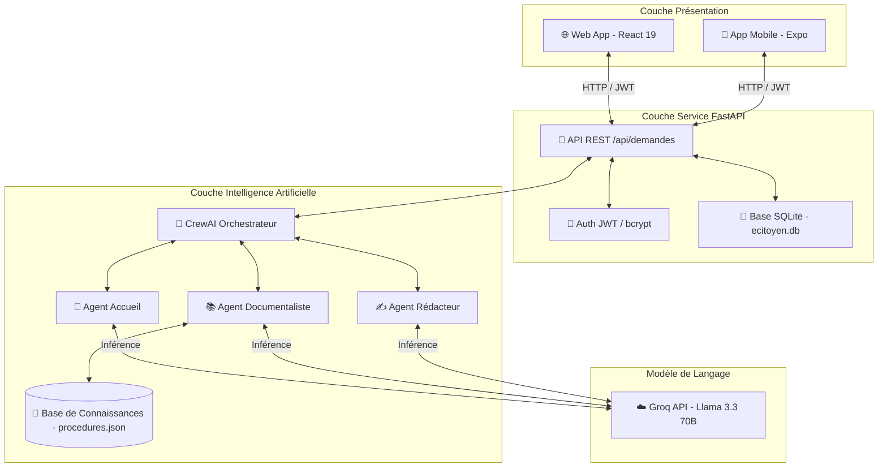

# 🏗️ Architecture Globale & Guide d'Intégration Mobile — e-Citoyen CI

Ce document présente l'architecture de référence pour le projet **e-Citoyen CI** (Assistant IA multi-agents pour les démarches administratives en Côte d'Ivoire). Il synthétise la structure du Backend, du Web, et détaille l'intégration de la version **Mobile (Expo/React Native)** via **Fastshot**.

---

## 🗺️ I. Vision Globale du Système

L'application e-Citoyen CI repose sur une architecture découplée où le client (Web ou Mobile) consomme une API REST FastAPI unifiée, laquelle orchestre un Crew de 3 agents IA (CrewAI + Groq) s'appuyant sur une base de connaissances locale.



---

## 📱 II. Architecture Mobile (Expo / React Native)

Pour le développement mobile rapide exigé, l'architecture s'appuie sur le framework **Expo (TypeScript)** et son routeur basé sur les fichiers (**Expo Router**).

### 1. Structure de dossiers recommandée (`mobile/`)
Cette structure permet une génération rapide des écrans via l'outil **Fastshot** sans perturber le code d'infrastructure (API, Auth, Thème).

```
mobile/
├── app/                            # 🧭 Expo Router (Navigation par fichiers)
│   ├── _layout.tsx                 # Provider racine (Session, Thème) & Layout Global
│   ├── index.tsx                   # Point d'entrée (Redirection automatique vers login/dashboard)
│   ├── login.tsx                   # Page d'authentification unifiée (Connexion / Inscription)
│   │
│   ├── (citizen)/                  # 👤 Espace Citoyen (Tabs)
│   │   ├── _layout.tsx             # Barre de navigation basse (Demandes, Paramètres)
│   │   ├── index.tsx               # Tableau de bord : raccourcis & statut dernière demande
│   │   ├── new-request.tsx         # Formulaire de saisie : texte + bouton micro (STT)
│   │   ├── requests.tsx            # Historique des demandes avec statuts (badge)
│   │   └── request/
│   │       └── [id].tsx            # Détail & plan d'action de l'IA (Copie de lettre, TTS)
│   │
│   └── (agent)/                    # 🤵 Espace Agent Administratif (V2)
│       ├── _layout.tsx             # Barre de navigation agent
│       ├── index.tsx               # Liste globale des demandes citoyennes
│       ├── requests.tsx            # Gestion des affectations
│       ├── request/
│       │   └── [id].tsx            # Traitement/Validation d'une demande par l'agent
│       └── statistics.tsx          # Statistiques de performance de traitement
│
├── components/                     # 🧩 Composants réutilisables
│   ├── AppHeader.tsx               # Barre supérieure avec logo et profil utilisateur
│   └── StatusBadge.tsx             # Badge de couleur dynamique selon l'état de la demande
│
├── constants/
│   └── theme.ts                    # 🎨 Tokens de Design (Charte graphique unifiée)
│
├── hooks/
│   └── useAuth.ts                  # 🔐 Hook personnalisé de gestion JWT & Session utilisateur
│
└── services/
    └── api.ts                      # 🔌 Client HTTP de communication avec le Backend FastAPI
```

### 2. Mapping des Routes (Web ➡️ Mobile)

| Route Web (React Router) | Fichier Mobile (Expo Router) | Rôle |
| :--- | :--- | :--- |
| `/` | `app/index.tsx` | Page d'accueil / Routeur principal |
| `/login` | `app/login.tsx` | Authentification (Connexion/Inscription) |
| `/citizen` | `app/(citizen)/index.tsx` | Dashboard Citoyen |
| `/citizen/new-request` | `app/(citizen)/new-request.tsx` | Formuler une nouvelle demande (Texte/Voix) |
| `/citizen/request/:id` | `app/(citizen)/request/[id].tsx` | Réponse de l'IA (Plan d'action, Lettre générée) |
| `/citizen/requests` | `app/(citizen)/requests.tsx` | Historique personnel des demandes |
| `/agent` | `app/(agent)/index.tsx` | Dashboard Agent Public |
| `/agent/requests` | `app/(agent)/requests.tsx` | Liste globale de gestion des dossiers |
| `/agent/request/:id` | `app/(agent)/request/[id].tsx` | Détail de validation d'un dossier |
| `/agent/statistics` | `app/(agent)/statistics.tsx` | Statistiques administratives (Délais, Volumes) |

---

## 🔌 III. Intégration Mobile ➡️ Backend (API & Sécurité)

### 1. Gestion de Session Persistante (JWT)
Sur mobile, l'absence de `localStorage` nécessite l'utilisation d'un stockage chiffré ou persistant propre aux architectures natives.
* **Stockage** : Utilisation de `@react-native-async-storage/async-storage` pour persister le JWT et les données de l'utilisateur connecté.
* **Intercepteur d'expiration** : Si l'API retourne un code `401 Unauthorized`, le token est supprimé et l'utilisateur est instantanément redirigé vers l'écran `app/login.tsx`.

#### 📝 Implémentation du service API mobile (`mobile/services/api.ts`) :
```typescript
import AsyncStorage from '@react-native-async-storage/async-storage';
import { router } from 'expo-router';

const API_URL = "https://e-citoyen-ci-backend.onrender.com"; // URL Render de production (ou IP locale en dev)

async function request<T = any>(url: string, options: RequestInit = {}): Promise<T> {
  const token = await AsyncStorage.getItem('token');
  const headers: HeadersInit = {
    'Content-Type': 'application/json',
    ...(token && { Authorization: `Bearer ${token}` }),
    ...options.headers,
  };

  const response = await fetch(`${API_URL}/api${url}`, {
    ...options,
    headers,
  });

  if (response.status === 401) {
    await AsyncStorage.multiRemove(['token', 'user']);
    router.replace('/login');
    throw new Error('Session expirée, veuillez vous reconnecter.');
  }

  if (!response.ok) {
    const error = await response.json().catch(() => ({}));
    throw new Error(error.detail || `Erreur ${response.status}`);
  }

  return response.json();
}

export const api = {
  auth: {
    login: (data: any) => request('/auth/login', { method: 'POST', body: JSON.stringify(data) }),
    register: (data: any) => request('/auth/register', { method: 'POST', body: JSON.stringify(data) }),
    logout: async () => {
      await AsyncStorage.multiRemove(['token', 'user']);
      router.replace('/login');
    }
  },
  demandes: {
    create: (data: { message: string; categorie?: string }) => request('/demandes/', { method: 'POST', body: JSON.stringify(data) }),
    getAll: () => request('/demandes/'),
    getOne: (id: string) => request(`/demandes/${id}`),
    getStats: () => request('/demandes/stats/overview'),
  }
};
```

### 2. Configuration CORS & Réseau (Côté Backend)
Pour que l'application mobile en développement puisse contacter le backend sans être bloquée par la politique CORS :
* **Développement** : Autoriser le joker (`"*"`) ou inclure les ports locaux d'Expo (`http://localhost:8081` et l'adresse IP locale de l'hôte `http://192.168.X.X:*`).
* **Production** : Configurer la variable d'environnement `CORS_ORIGINS` dans Render pour inclure le domaine de l'application web et les connexions d'applications natives.

---

## 🔊 IV. Couche Vocale : Transition Web ➡️ Mobile

Le système utilise la reconnaissance vocale pour la saisie de texte et la synthèse vocale pour dicter le plan d'action à haute voix.

```
[Web] Web Speech API  ──────────┐
                                ├─► Spécificités de plateforme unifiées
[Mobile] API Expo Native ───────┘
```

### 1. Synthèse Vocale (Lecture de texte - TTS)
* **Web** : Utilise l'API du navigateur `window.speechSynthesis`.
* **Mobile** : Utilise la bibliothèque Expo `expo-speech`.
  * *Code d'intégration mobile* :
    ```typescript
    import * as Speech from 'expo-speech';
    
    // Déclenche la lecture vocale
    const playResponse = (text: string) => {
      Speech.speak(text, { language: 'fr-FR', rate: 1.0 });
    };
    ```

### 2. Reconnaissance Vocale (Dictée vocale - STT)
* **Web** : Utilise `window.SpeechRecognition` (ou `webkitSpeechRecognition`).
* **Mobile** : Utilise `expo-speech-recognition` pour s'interfacer directement avec les moteurs de reconnaissance natifs (iOS/Android).
  * *Code d'intégration mobile* :
    ```typescript
    import { SpeechRecognition } from 'expo-speech-recognition';
    import * as Haptics from 'expo-haptics';

    const startRecording = async (onTextCaptured: (text: string) => void) => {
      const { granted } = await SpeechRecognition.requestPermissionsAsync();
      if (!granted) return;

      // Haptic feedback pour indiquer le début de l'écoute
      Haptics.notificationAsync(Haptics.NotificationFeedbackType.Success);

      SpeechRecognition.start({
        lang: 'fr-CIV', // Version française de Côte d'Ivoire
        onResult: (event) => {
          if (event.isFinal) {
            onTextCaptured(event.transcript);
          }
        }
      });
    };
    ```

---

## 🧠 V. Architecture des Agents IA (CrewAI)

Le traitement de la demande citoyenne (ex: *"Je n'ai pas de déclaration de naissance pour mon enfant"*) s'exécute de manière séquentielle à travers 3 agents définis dans le backend :

```
Saisie Citoyen (Texte ou Voix)
         │
         ▼
 🤵 Agent Accueil (Compréhension & Classification)
         │
         ▼ (Catégorie ex: acte_naissance)
 📚 Agent Documentaliste (Recherche de la procédure dans procedures.json)
         │
         ▼ (Pièces requises, délais, coûts, mairie)
 ✍️ Agent Rédacteur (Génération du Plan d'action & de la Lettre officielle)
         │
         ▼
Réponse Structurée finale (Formatée JSON via Pydantic)
```

### Contrat de Données Structuré (Pydantic)
Pour garantir la robustesse des données renvoyées aux clients web et mobile, le backend utilise le modèle `ReponseCitoyen` :
```python
class ReponseCitoyen(BaseModel):
    resume_situation: str        # Condensé vulgarisé de la situation du citoyen
    plan_action: list[str]       # Étapes chronologiques détaillées
    documents_a_apporter: list[str] # Pièces administratives exigées
    lieu: str                    # Administration locale (ex: Mairie de Yopougon)
    delai_estime: str            # Temps de traitement officiel
    cout: str                    # Frais légaux ou gratuité
    lettre_generee: bool         # Présence d'un modèle de courrier
    contenu_lettre: str | None   # Texte de la lettre pré-remplie
```

---

## 🎨 VI. Design System & Charte Graphique Unifiée

Pour que l'application Web et Mobile partagent la même identité visuelle, les tokens de design de la Côte d'Ivoire sont standardisés :

### 1. Palette de Couleurs (Couleurs de la République)
* **Terracotta (`#C86A4A`)** : Représente la terre ivoirienne, utilisée pour les boutons et éléments d'action majeurs.
* **Vert Forêt (`#2E6B57`)** : Symbole de l'espérance et de la nature, utilisé pour les validations et succès.
* **Orange Officiel (`#D9622B`)** : Rappel du tampon administratif officiel, utilisé pour les alertes et statuts intermédiaires.
* **Parchemin Moderne (`#F5EFE3`)** : Couleur de fond, inspirée des documents officiels pour inspirer confiance et solennité.
* **Texte Sombre (`#1E1E1E`)** : Couleur principale des écrits pour une lisibilité maximale.

### 2. Typographie
* **Titre** : Police avec empattement (Serif) pour rappeler les en-têtes officiels de l'État.
* **Contenu** : Sans-serif propre (ex: Inter ou Roboto) pour une lecture claire et sans effort sur petit écran.

---

## 🚀 VII. Guide Fastshot pour Morel (Génération Mobile Rapide)

Pour que Morel puisse générer l'interface utilisateur mobile directement avec **Fastshot**, il doit utiliser le prompt structuré suivant :

> ### 📝 Copier-coller pour l'outil Fastshot :
> 
> "Génère les écrans de l'application mobile e-Citoyen CI en React Native Expo avec Expo Router, en utilisant Tailwind CSS pour le style.
>
> **Design & Couleurs** :
> - Fond de page : `#F5EFE3` (beige parchemin texturé et propre)
> - Éléments primaires / Boutons : `#C86A4A` (terracotta ivoirienne)
> - Succès / Validations : `#2E6B57` (vert forêt de l'espérance)
> - Textes importants / Titres administratifs : `#1E1E1E` (noir profond)
> - Typographie de titre solennelle et en-tête de lettre officielle.
> 
> **Écrans à implémenter** :
> 1. **Login (`app/login.tsx`)** : Connexion et inscription épurées avec logo e-Citoyen CI et champs d'email et mot de passe.
> 2. **Dashboard Citoyen (`app/(citizen)/index.tsx`)** : Accueil avec les raccourcis vers les démarches courantes (Acte de naissance, CNI, CMU) et une bannière affichant le statut de la dernière demande. Bouton principal "Faire une nouvelle demande".
> 3. **Nouvelle Demande (`app/(citizen)/new-request.tsx`)** : Zone de saisie de texte extensible pour expliquer sa situation personnelle. Ajoute un gros bouton rond avec un icône de micro. Ce bouton doit réagir tactilement et afficher une micro-animation d'ondes sonores vert forêt lors du clic pour simuler l'enregistrement vocal (STT).
> 4. **Détail de la Réponse (`app/(citizen)/request/[id].tsx`)** : Affiche les données retournées par l'IA :
>    - Encadré "Résumé de votre situation"
>    - Liste à puces interactive "Pièces à fournir" avec cases à cocher
>    - Frise chronologique (Timeline) "Votre plan d'action"
>    - Une section de synthèse avec les étiquettes : Lieu de dépôt, Délai estimé, Coût officiel
>    - Si une lettre est disponible : Affiche un encadré façon papier avec la lettre rédigée, munie d'un bouton "Copier le texte" et "Envoyer par email".
>    - Bouton d'action vocal "Écouter les étapes" (déclenchant la lecture haute voix).
> 5. **Historique des demandes (`app/(citizen)/requests.tsx`)** : Liste des demandes passées triées par date avec un badge de couleur pour le statut de traitement.
> 
> **Logique de code** :
> - Intègre les appels API via les hooks personnalisés `useAuth` et le client `@/services/api` déjà présents.
> - Persiste le jeton d'authentification avec `AsyncStorage`.
> - Utilise `expo-speech` pour le bouton de lecture audio TTS de la réponse IA."
